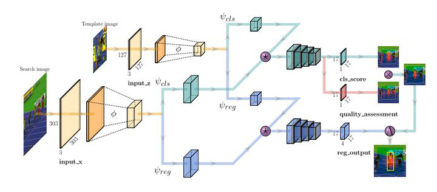
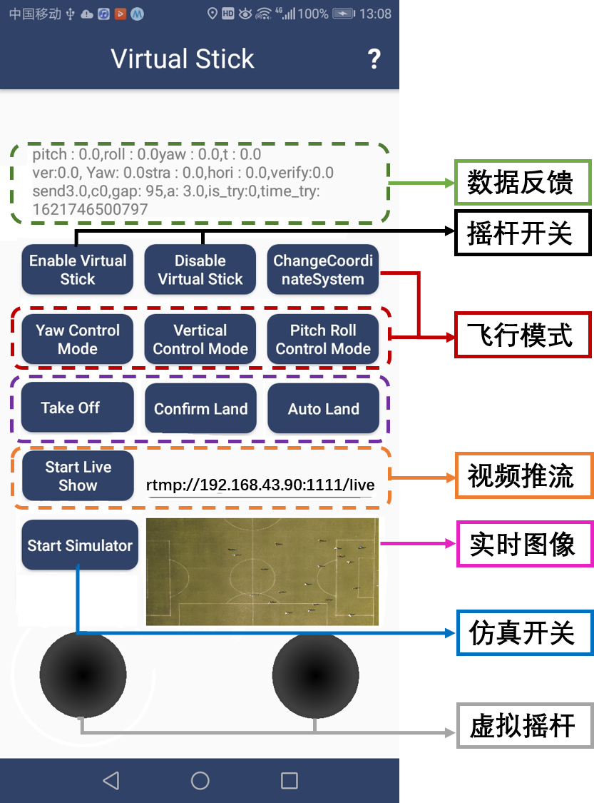

## Offside judgment for soccer matches using drones

#### Abstract

- 足球是世界第一大运动，具有广阔的市场前景。足球比赛中的越位是一种常见的犯规行为，若在对方半场，接球球员包含门将在内的倒数第二名防守球员距离端线更近，同时比球距离端线更近，并试图借此位置干扰对方球员争球，干扰比赛，则会被判罚越位。但因为比赛节奏快，边裁很难出现在最佳的判罚位置且视线极易被其他球员遮挡，而视频助理裁判（VAR）技术仅仅提供了视频回放，而不能自动判罚，不仅成本高昂且会中断比赛，降低比赛观赏度。因此，我们项目实现了利用无人机，从无任何遮挡的俯视视角进行自主的越位判罚。本项目构建了一套针对极小目标（球员≈15p*10p，足球≈5p*5p）的识别、分类与跟踪算法，兼顾实时性与准确度，并具有一定的多个足球比赛场景的适用性。同时，我们通过开发的Android APP作为中继构建了有效的PC与无人机通信机制，将算法应用于实际无人机（DJI Mavic Air2），完成无人机自主运动并进行判罚。在三好杯足球比赛的测试中进行了准确的判罚，并且成功判罚了未被值勤边裁发现的越位现象。

#### Framework

- #### **Player Detection and Tracking**

  利用采集到的无人机视角下的视频数据训练YOLOv4，获得图像中球员的位置，对获得的bbox范围内的图像采用orb角点检测来构建对应图像的掩膜获得更紧的检测框。将获得的每个球员检测框分配到一个进程中，在该进程中利用SiamFC++进行跟踪。若出现SiamFC++跟踪丢失的现象，或经过了一定数量的帧数，则重新调用YOLOv4获得球员检测框，重复进行。

  若直接使用sort或者deep sort的多目标追踪（MOT）算法检测精度不高，很难找到小目标的人，而且需要大量的训练数据。而本算法中，球员的识别与跟踪主要依靠每一个子进程中的SiamFC++算法，SiamFC++速度快，对快速移动的小目标物体也有很好的跟踪能力，而YOLOv4仅为了获得初始检测框和更新丢失目标，避免一直使用YOLOv4造成的识别跟踪速度变慢。

- #### **Ball Detection and Tracking**

  球识别部分主要融合了基于连通域评分函数的足球局部识别和全图识别、siamFC++、卡尔曼滤波预测的方法。

  A. 各算法简介：

  - 基于连通域评分函数的足球识别

    首先，对于图像进行预处理：采用sobel算子滤波去除背景，利用HSV的颜色滤波去除影子影响。构建二值图的连通域。

    其次，对于连通区域计算评分，综合考虑球的形态，构造的评分函数包含三个部分：周长面积比、宽高比、结构相似度（SSIM）。若联通区域越接近球，则三个部分越接近1。选择各个连通域中得分最高的部分作为识别目标。

    

    

  -  SiamFC++

    为了获得快速准确的目标跟踪算法，我们尝试了多种算法，最后发现论文：**Xu Y, Wang Z, Li Z, et al. Siamfc++: Towards robust and accurate visual tracking with target estimation guidelines[C]//Proceedings of the AAAI Conference on Artificial Intelligence. 2020, 34(07): 12549-12556.**中的SiamFC++算法效果很好。SiamFC++最大的优势在于他是通过两张图片的相似度进行追踪的，所以只需要使用预训练能够提取图片特征的网络就可以完成追踪任务，并不需要知道追踪的具体是什么物体。此外Siamfcpp的网络非常简单，前向传播速度快实时性好。它利用局部追踪的思想对输入图片进行裁剪也提高了速度。而采用锚框尺寸学习的方法也可以使检测框能够紧紧贴合人，符合越位判罚的目标。

    

  - 卡尔曼滤波

    因为足球具有运动过程中近似匀速直线运动的特点，因此构建了线性运动的卡尔曼滤波器，结合实际的检测框进行更新，并获得预测位置。

    

  - A. 算法融合

    为了保证球的顺利稳定的跟踪，我们设定了4层机制来对球进行跟踪。当进行初始化的时候，会使用全局球检测来获取球的位置，如果获得正确的位置，就用所在的位置进行卡尔曼滤波器和siamFC++跟踪器的初始化，然后进入循环。

    每读一张图片，先通过siamFC++进行跟踪并完成卡尔曼滤波器的预测，分别返回球的结果。

    1. siamFC++跟踪到结果，将siamFC++的结果对比和球的相似度。

    ​	1.1如果达到了一定的阈值，那么siamFC++跟踪顺利，更新卡尔曼滤波器并输出结果。

    ​	1.2如果相似度不达标，那么会调用局部球检测算法，也即取siamFC++返回结果的周围一定范围内进行检测。

    ​		1.2.1如果局部检测到球，用球之前一帧的结果经过噪点检测

    ​			1.2.1.1 如果判断不为噪声，那么输出局部检测的结果，并且初始化siamFC++,更新卡尔曼滤波器。

    ​			1.2.1.2 如果判断为噪声，调用全局检测

    ​				1.2.1.2.1. 如果全局球检测到球，进行噪点检测

    ​					a. 如果判断不为噪声，那么输出全局检测的结果，并且初始化siamFC++,更新卡尔曼滤波器。

    ​					b. 如果判断为噪声，输出卡尔曼滤波预测的结果

    ​				1.2.1.2.2.. 如果全局检测不到球，输出卡尔曼滤波预测结果

    ​		1.2.2如果局部检测不到球，同1.2.1.1

    2.siamFC++丢失跟踪目标，同1.2 

    除了以上的机制来保证球跟踪的稳定性和正确性，我们还采用了打断机制，让球检测以一定的频率重新全图检测来确认跟踪的正确性。

    通过以上的流程，最后就可以获得稳定正确的球跟踪结果，并对球员遮挡，球高速运动等情况有一定的适应性

    

  - #### Player Classification

    因为每队的球员的队服颜色不同，因此球员分类采用颜色特征。对每个球员小图像的颜色特征提取，首先采用orb角点检测来构建对应图像的掩膜，减少背景对颜色特征的干扰。然后对图像变换为HSV颜色空间，为了抑制影子对颜色特征的干扰，以HV两通道像素的像素值经过直方图统计后的统计特征作为图像的颜色特征。

    实际运行过程中，首先根据场上已有的球员图像，由人对其中三种类别进行区分，然后自动截取随后20帧内的对应球员的图像数据，提取其颜色特征，保存为分类器的训练数据。之后对每张跟踪到的球员图像提取颜色特征，对比其特征与数据各个点的欧式距离，用KNN算法完成分类。

  - #### Offside Line

    对图像进行预处理变化后变为二值图，利用Houghline提取画面中较长线段，并计算这些线段y=kx+b的k与b，剔除与k的中位数相差较大的直线。之后选取距离最后一名防守球员最近的线段的斜率作为越位线的斜率，并在该防守球员的边缘点以该斜率画出越位线。

  - #### Communication with Drones

    由于DJI Mavic Air2不开源，因此利用DJI MSDK开发一个APP作为PC与无人机的通信中继，将无人机拍摄的视频实时地通过RTMP推流的方式传给PC进行运算。待PC运算结束后向APP发送运动控制指令（前进与后退速度vx，左右速度vy，上升下降速度vz，左右偏航速度vyaw），APP接收到指令后再向无人机发送运动控制指令，实现无人机的自主飞行控制。APP主要包括七大模块：

    1）数据反馈：主要用于实时显示无人机的一些运动参数与调试所用的数据；

    2）摇杆开关：负责虚拟摇杆功能的开启与关闭，开启后进入自动飞行状态，关闭后无人机可以用遥控器进行手动运动控制；

    3）飞行模式：主要用于选择运动坐标系、所发指令类型（position或velocity）等；

    4）视频推流：负责开启视频推流让PC可以获得实时视频数据；

    5）实时图像：显示无人机实时拍摄的画面；

    6）仿真开关：用于切换仿真环境调试和实际飞行；7）虚拟摇杆：在调试时用于验证虚拟摇杆功能。

    

#### Advantage

- 应用场景新颖

  足球场景充分利用无人机更为自由的视角，提供了辅助越位判决的新思路 

- 跟踪算法高效

  构建了一套针对极小目标的识别、分类与跟踪算法，兼顾实时性与准确度，并具有一定的多足球比赛场景适用性。 

- 实机飞行自主

  利用开发的Android APP 作为中继构建了有效的通信机制，将算法应用于实际无人机，完成无人机自主运动并进行判罚。 

- 数据标注简易

  构建了一种半自动的同类场景数据标注方式，大量节省用于模型训练的数据标注时间与成本。

#### Application

-  **提升足球比赛越位判罚速度、精度**

  足球比赛中经常会出现裁判做出错误判罚的情况，这大大影响了观众的观赛体验。因此将科技引入体育比赛成为了近几年的趋势，比如足球比赛中的门线技术以及视频助理裁判。但是这些技术归根结底还是对回放视频进行处理以辅助人眼判断，而非机器自己做出的判断。这种方式使得原本连贯的比赛变得支离破碎。而本项目的自动越位判罚无人机能够自动产生判罚结果，避免因为裁判自身视角的限制或是人眼的局限所造成的误判，使得比赛过程更加流畅，增强比赛可看性和结果公正性。 

-  **降低体育场馆成本** 

  在高级别的体育赛事中，得益于先进的比赛场地，可以应用如鹰眼和视频助理裁判等高度依赖设备性能的技术。但是对于大多数场地设施无法达到要求的比赛，这些技术成本过于高昂。而本项目的自动越位判罚无人机成本低廉，可以有效降低体育场馆的成本。

